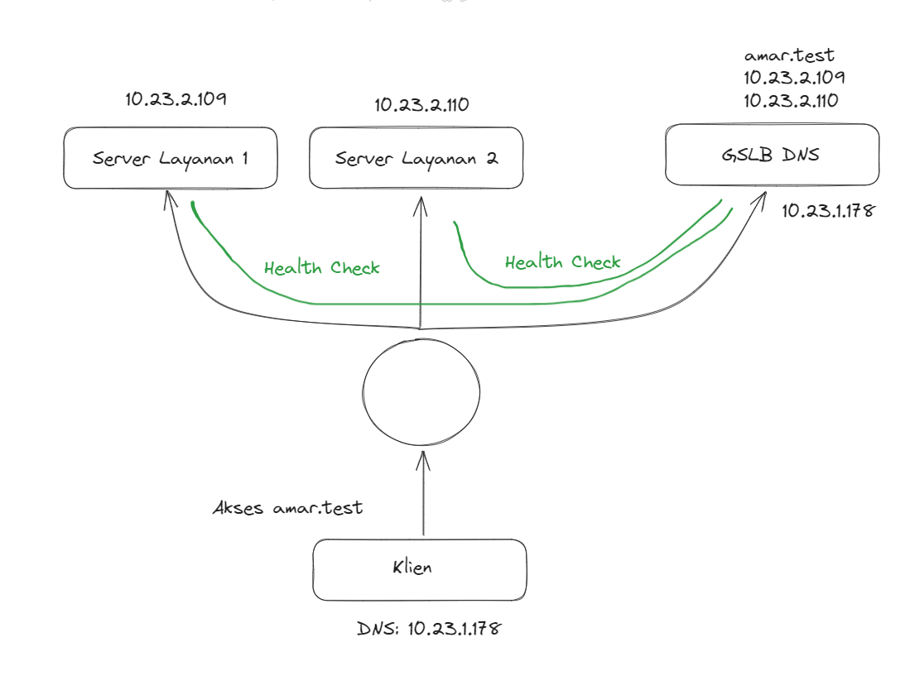
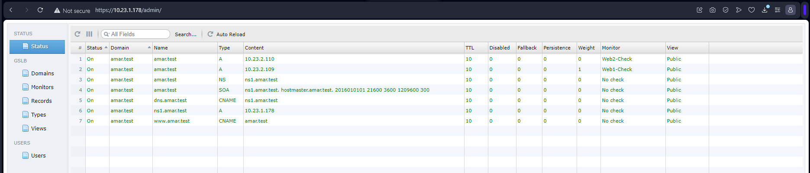
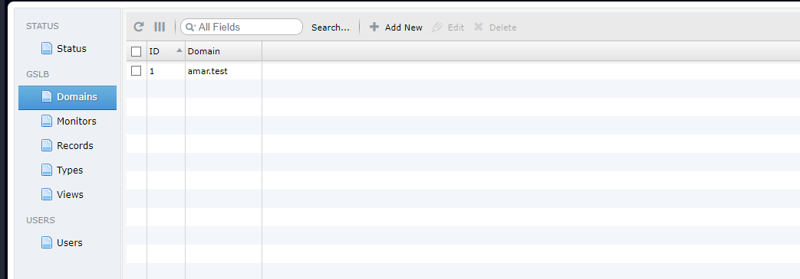
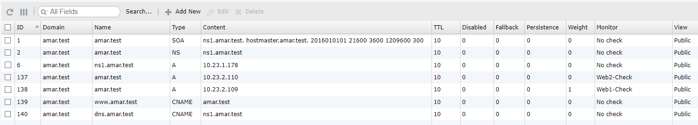
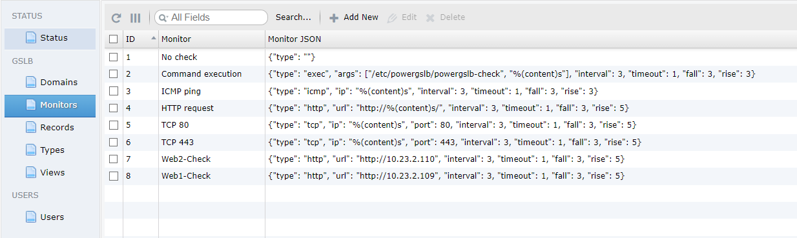
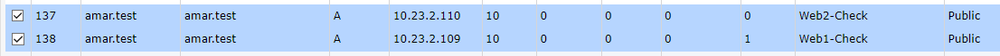
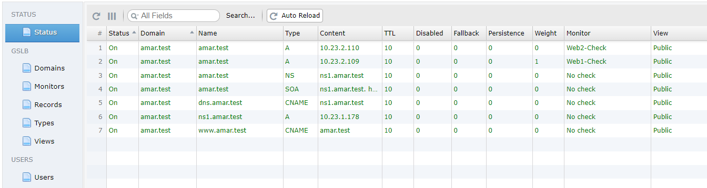
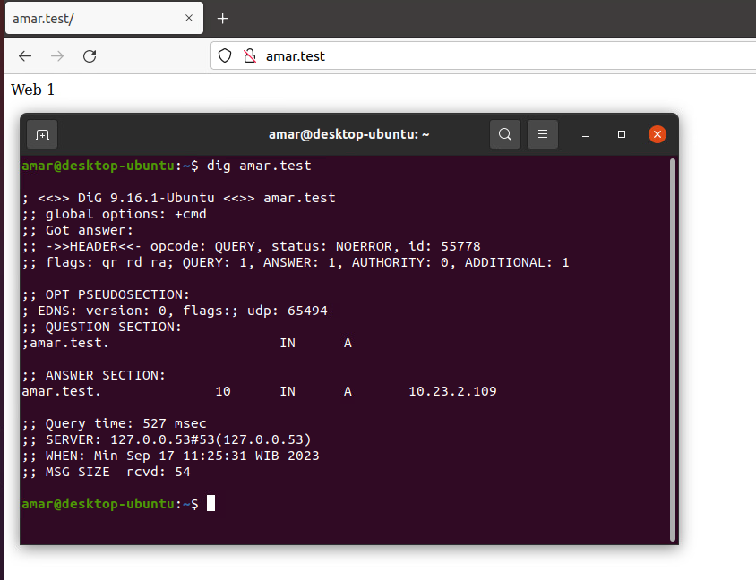
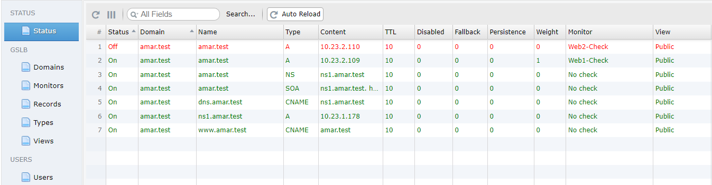
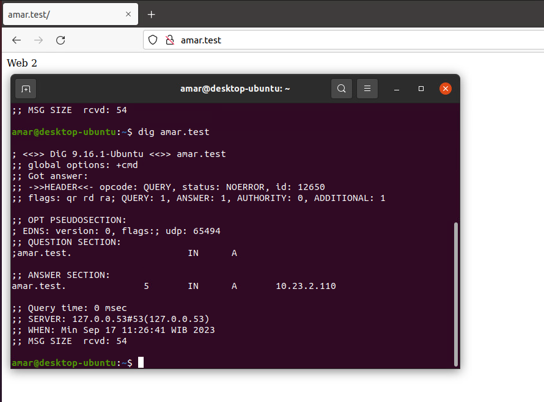

> From acudovs - [powergslb](https://github.com/acudovs/powergslb)


# PowerGSLB
PowerGSLB adalah service Global Server Load Balancing (GSLB). Global Server Load Balancing (GSLB) sendiri berguna untuk menentukan trafik dengan menggunakan service DNS. Berbeda dengan load balancing menggunakan reverse proxy, GSLB menentukan trafik dari dua server berdasarkan IP dan domain.

PowerGSLB merupakan salah satu service pendukung dari PowerDNS yang berfungsi sebagai GSLB. PowerGSLB ini dapat diinstal pada sistem operasi CentOS 7. Pada awalnya, PowerGSLB melakukan monitoring terhadap target yang telah ditentukan. Kemudian, PowerGSLB memiliki beberapa metode pengecekan yang bisa digunakan, diantaranya yaitu:

1. **Exec**
    
    Metode ini melakukan pengecekan sebuah server tujuan yang hendak di load balance dengan mengeksekusi atau menjalankan sebuah perintah. Perintah yang telah ditentukan akan dijalankan pada server PowerGSLB. 
    
2. **ICMP**
    
    Dengan metode ini, server melakukan pengecekan dengan melakukan ping ke tujuan yang telah ditentukan.
    
3. **TCP**
    
    Metode ini melakukan pengecekan dengan percobaan koneksi TCP. Port yang dituju juga dapat ditentukan, seperti TCP port 25, 80, atau 443.
    
4. **HTTP**
    
    Metode ini melakukan pengecekan dengan permintaan HTTP. Metode ini cocok digunakan untuk load balance website dengan konten yang sama namun berbeda server atau IP address.
    

Selain metode pengecekan dalam monitoring, PowerGSLB juga menggunakan beberapa parameter dalam menentukan arah trafik, diantaranya yaitu:

1. **Fallback**
    
    Berbeda dengan parameter lainnya, dengan parameter ini, PowerGSLB akan mendaftarkan beberapa record ke dalam satu domain. Ketika menggunakan Domain Information Groper atau ****dig, akan ada IP yang terdaftar dari beberapa tujuan. Dengan parameter ini juga down time akan lebih minimal dirasakan oleh klien.
    
2. **Persistence**
    
    Parameter ini berorientasi pada konsistensi koneksi ke satu server tujuan. Semisal terdapat dua IP atau server yang terdaftar dalam satu domain, ketika klien mengakses IP tersebut, PowerGSLB akan mengarahkan klien tersebut ke satu server secara konsisten. Kekurangan dari parameter ini adalah down time yang lebih terasa karena algoritmanya yang mempertahankan koneksi.
    
3. **Weight**
    
    Dengan parameter ini, klien akan diberikan jawaban alamat atau IP berdasarkan bobot yang diatur. Nilai yang lebih besar menunjukkan tingkat prioritasnya lebih tinggi.
## Instalasi
### Instal dan Setup PowerGSLB dan PowerDNS
Siapkan dan atur manajer paket serta instal paket yang dibutuhkan nantinya:
```
yum -y install epel-release
yum -y update
yum -y install python2-pip
pip install pyping
```
Instal PowerGSLB dengan paket penginstalan dari github yang sudah termasuk PowerDNS didalamnya:
```
VERSION=1.7.4
yum -y --setopt=tsflags= install \
    "https://github.com/AlekseyChudov/powergslb/releases/download/$VERSION/powergslb-$VERSION-1.el7.noarch.rpm" \
    "https://github.com/AlekseyChudov/powergslb/releases/download/$VERSION/powergslb-admin-$VERSION-1.el7.noarch.rpm" \
    "https://github.com/AlekseyChudov/powergslb/releases/download/$VERSION/powergslb-pdns-$VERSION-1.el7.noarch.rpm"
```
Konfigurasi dan masukkan password database yang akan digunakan PowerGSLB:
```
sed -i 's/^password = .*/password = your-database-password-here/g' /etc/powergslb/powergslb.conf
```
Copy file konfigurasi PowerDNS dari paket penginstalan ke dalam direktori etc:
```
cp /etc/pdns/pdns.conf /etc/pdns/pdns.conf~
cp "/usr/share/doc/powergslb-pdns-$VERSION/pdns/pdns.conf" /etc/pdns/pdns.conf
```

### Instal dan Setup MariaDB
Lakukan instalasi MariaDB:
```
yum -y install mariadb-server
```
Konfigurasi bind address MariaDB:
```
sed -i '/\[mysqld\]/a bind-address=127.0.0.1\ncharacter_set_server=utf8' /etc/my.cnf.d/server.cnf
```
Jalankan service MariaDB dan lihat statusnya:
```
systemctl enable mariadb.service
systemctl start mariadb.service
systemctl status mariadb.service
```
Jalankan konfigurasi keamanan mysql jika diperlukan: (Optional)
```
mysql_secure_installation
```
Buat user dan database beserta strukturnya menggunakan file sql yang ada di dalam paket penginstalan:
```
VERSION=1.7.4
mysql -p << EOF
CREATE DATABASE powergslb;
GRANT ALL ON powergslb.* TO powergslb@localhost IDENTIFIED BY 'your-database-password-here';
USE powergslb;
source /usr/share/doc/powergslb-$VERSION/database/scheme.sql
source /usr/share/doc/powergslb-$VERSION/database/data.sql
EOF
```
Jalankan service PowerGSLB dan PowerDNS:
```
systemctl enable powergslb.service pdns.service
systemctl start powergslb.service pdns.service
systemctl status powergslb.service pdns.service
```
Izinkan port HTTP, HTTPS, dan DNS:
```
firewall-cmd --permanent --add-port=80/tcp --permanent
firewall-cmd --permanent --add-port=443/tcp --permanent
firewall-cmd --permanent --add-port=53/tcp --permanent

firewall-cmd --permanent --add-service=http --permanent
firewall-cmd --permanent --add-service=https --permanent
firewall-cmd --permanent --add-service=dns --permanent

firewall-cmd --reload
firewall-cmd --list-all
```

## Cara Penggunaan
Berikut topologi yang digunakan sebagai contoh:


Akses `https://IP-server/admin`:


> Saat pertama kali membuka PowerGSLB, pasti akan ada banyak template yang tersedia. Hapus template yang tidak digunakan pada menu Records terlebih dahulu, kemudian hapus juga template pada menu Domains.

Buat domain baru pada menu Domains:


Setelah itu klik menu Records dan buat record sesuai dengan kebutuhan. Pada contoh di bawah ini membuat record domain yang digunakan untuk dua buah web server:


Pada saat pembuatan record baru, akan ada field monitor yang perlu di isi. Monitor ini merupakan metode yang digunakan PowerGSLB untuk menentukan arah atau pembagian sebuah trafik. Untuk membuatnya, klik menu Monitors:

Setelah itu buat baru dengan klik Add New. Pada contoh di atas membuat dua buah Monitor baru yaitu Web1-Check dan Web2-Check dengan metode atau tipe http. 
> Dengan metode tersebut, PowerGSLB akan melakukan permintaan HTTP ke URL yang telah ditentukan untuk menentukan server yang dituju hidup atau mati.

Kemudian gunakan monitor yang telah dibuat pada record:

Atur weight untuk mengatur prioritas, semakin besar nilai weight menunjukkan prioritas yang lebih tinggi.

Pada menu status kita bisa melihat status dari record yang dibuat:



Ketika server atau service web server tidak dapat dihubungi, maka statusnya akan berubah dan akses domain diubah ke server kedua:



Untuk dokumentasi aslinya dapat dilihat di [powergslb](https://github.com/acudovs/powergslb)
